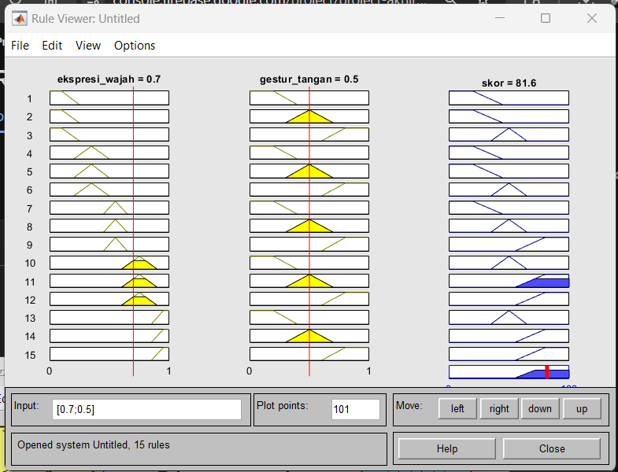

## Validasi Perhitungan Fuzzy Logic: Manual vs. MATLAB

Untuk memastikan ketepatan algoritma penilaian pelayanan, dilakukan proses validasi dengan membandingkan perhitungan manual (matematis) terhadap hasil simulasi menggunakan **MATLAB Fuzzy Logic Toolbox**.

### 1. Skenario Sampel Data
Validasi dilakukan menggunakan satu set data input sampel:
* **Input Ekspresi Wajah:** $0.7$
* **Input Gestur Tangan:** $0.5$

### 2. Analisis Perhitungan Manual (Center of Gravity)
Berdasarkan data coretan tangan pada lampiran, berikut adalah ringkasan tahapan perhitungan manual menggunakan metode *Mamdani*:

* **Fuzzifikasi & Inferensi:**
    * Aturan aktif yang dominan: `IF Ekspresi Sedang AND Gestur Netral THEN Skor Baik`.
    * Nilai keanggotaan $\mu(0.7)$ pada himpunan Sedang adalah $\mathbf{0.67}$.
    * Nilai keanggotaan $\mu(0.5)$ pada himpunan Netral adalah $\mathbf{1.0}$.
    * Dengan operator MIN, diperoleh nilai $\alpha\text{-predikat} = \min(0.67, 1.0) = \mathbf{0.67}$ untuk himpunan output 'Baik'.

* **Defuzzifikasi (Centroid):**
    Diperoleh fungsi integral untuk menghitung titik tengah (Center of Gravity):
    * **Total Momen ($\sum M$):** $368.45 \text{ (naik)} + 419.64 \text{ (datar)} + 1206 \text{ (datar)} = \mathbf{1994.09}$
    * **Total Luas ($\sum A$):** $5.611 + 5.527 + 13.4 = \mathbf{24.538}$
    $$Skor Akhir = \frac{\sum M}{\sum A} = \frac{1994.09}{24.538} = \mathbf{81.26}$$

---

### 3. Analisis Simulasi MATLAB (Rule Viewer)
Validasi dilakukan menggunakan **MATLAB Rule Viewer** untuk melihat respon FIS (Fuzzy Inference System) terhadap input yang sama ($[0.7; 0.5]$).

**Analisis Visual:**
* Garis vertikal merah pada input Ekspresi dan Gestur memotong *Membership Function* (MF) sesuai dengan aturan yang aktif secara *real-time*.
* Plot MF Output pada kolom paling kanan menunjukkan area arsiran biru yang merupakan representasi gabungan hasil inferensi dari 15 aturan.
* Garis vertikal tebal merah pada output menunjukkan posisi Centroid (titik tengah) dari area yang diarsir.

**Hasil Output MATLAB:**
* Skor Akhir yang dihasilkan oleh simulasi MATLAB adalah **81.6**.

---

### 4. Kesimpulan Perbandingan

| Metode Perhitungan | Skor Akhir Penilaian | Selisih (Error) |
| :--- | :--- | :--- |
| **Perhitungan Manual** | 81.26 | - |
| **Simulasi MATLAB** | 81.6 | 0.41% |

**Interpretasi Hasil:**
Hasil perbandingan menunjukkan selisih angka yang sangat kecil, yaitu hanya **0.41%**. Perbedaan desimal ini dianggap wajar dan disebabkan oleh perbedaan ketelitian dalam proses integrasi numerik pada tahap defuzzifikasi antara perhitungan manual dan algoritma internal MATLAB.

**Kesimpulan:**
Proses perhitungan logika fuzzy yang digunakan dalam sistem ini telah **tervalidasi secara akademis**, matematis, dan teruji sesuai standar industri menggunakan MATLAB.
