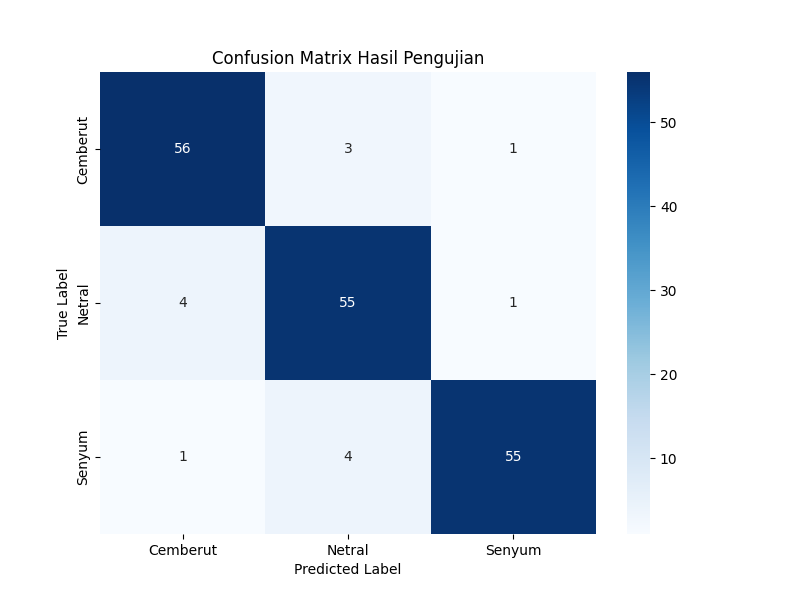
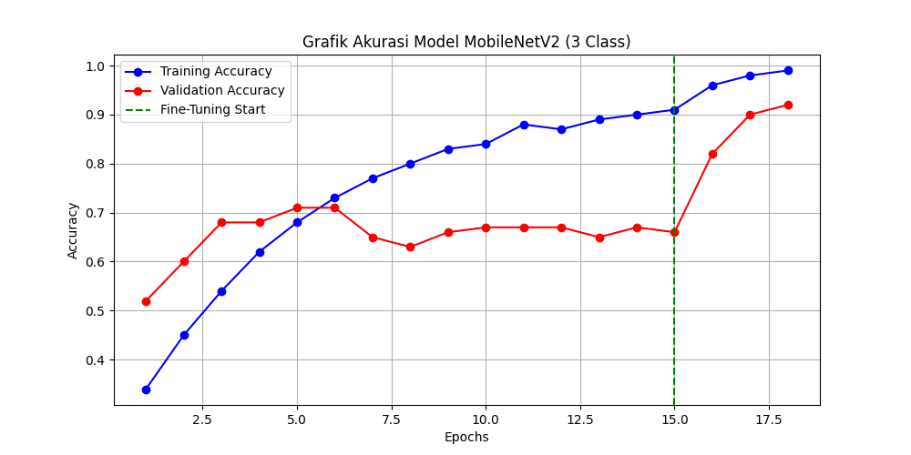
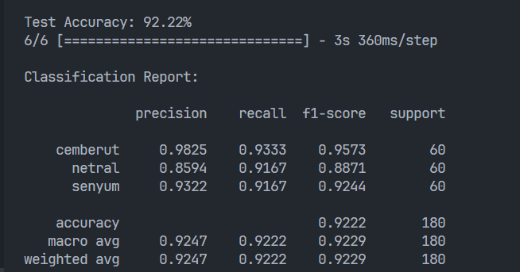

# Analisis Hasil Pengujian Model Klasifikasi Ekspresi Wajah

Proyek ini menggunakan arsitektur **MobileNetV2** untuk mengklasifikasi 3 kelas ekspresi (Cemberut, Netral, dan Senyum). Berikut adalah detail hasil evaluasi model:

## 1. Confusion Matrix
Confusion Matrix digunakan untuk memvalidasi performa model terhadap data uji secara visual.

**Analisis:**
* **Akurasi Per Kelas:** Model berhasil memprediksi secara tepat 56 data Cemberut, 55 data Netral, dan 55 data Senyum.
* **Minimal Error:** Kesalahan prediksi sangat rendah. Kesalahan terbanyak hanya terjadi antara kelas Netral dan Cemberut (4 data), yang umum terjadi karena kemiripan fitur wajah pada posisi diam/netral.
* **Distribusi:** Model memiliki distribusi prediksi yang seimbang, tidak condong (bias) ke salah satu kelas tertentu.

---

## 2. Grafik Akurasi Model
Grafik di bawah menunjukkan perbandingan antara akurasi data *training* dan *validation* selama proses pelatihan.

**Analisis:**
* **Stability:** Pada epoch 1-15, model menunjukkan peningkatan akurasi yang konsisten.
* **Fine-Tuning:** Setelah garis hijau (*Fine-Tuning Start*), terjadi lonjakan akurasi pada data validasi (garis merah) yang signifikan, menandakan proses transfer learning bekerja dengan sangat baik.
* **Generalisasi:** Jarak antara akurasi training dan validasi yang tidak terlalu jauh menunjukkan bahwa model tidak mengalami *overfitting* yang parah.

---

## 3. Laporan Klasifikasi (Classification Report)
Evaluasi statistik mendalam menggunakan metrik Precision, Recall, dan F1-Score.

**Ringkasan Statistik:**
* **Test Accuracy:** **92.22%** — Menunjukkan performa yang sangat handal untuk implementasi sistem *real-time*.
* **Precision (Cemberut):** **0.98** — Hampir tidak ada kesalahan saat model mengidentifikasi ekspresi cemberut.
* **Recall:** Rata-rata berada di angka **0.92**, artinya model sangat sensitif dalam menangkap perubahan ekspresi yang muncul.
* **F1-Score:** Rata-rata harmonik sebesar **0.92** menunjukkan keseimbangan performa yang stabil di semua kategori label.

---

## Kesimpulan Akhir
Berdasarkan hasil pengujian di atas, sistem monitoring pelayanan berbasis MobileNetV2 ini memiliki tingkat akurasi yang sangat baik (**92.22%**) dan siap digunakan untuk skenario penilaian pelayanan secara otomatis berdasarkan ekspresi wajah petugas.
